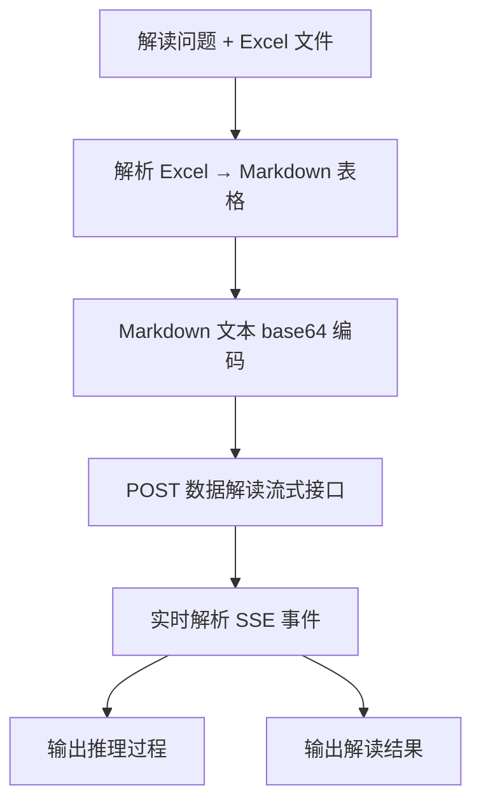

# QBI 小Q解读技能

通过 Quick BI 小Q解读开放 API，将上传的 Excel 文件（.xls / .xlsx）解析为 Markdown 表格，经 base64 编码后发送至数据解读流式接口，生成深度分析结果。

## 配置

本技能采用 **配置分层** 架构，用户配置与技能包分离，**技能包更新不会覆盖用户配置**。

### 配置加载优先级（高覆盖低）

1. **环境变量** `ACCESS_TOKEN`（最高优先级，适合容器部署）
2. **skill 级用户配置** `~/.qbi/smartq-data-insight/config.yaml`（仅当前 skill，**禁止**存放 `server_domain`/`api_key`/`api_secret`/`user_token`）
3. **QBI 全局配置** `~/.qbi/config.yaml`（所有 skill 共享）
4. **默认配置** 技能包内 `default_config.yaml`（包内默认值，随包更新）

所有配置项（`server_domain`、`api_key`、`api_secret`、`user_token`）统一放在全局配置 `~/.qbi/config.yaml`。

### 配置项说明

- **`server_domain`**：Quick BI 服务域名
- **`api_key`** / **`api_secret`**：OpenAPI 认证密钥对（未配置时使用内置默认值进入试用）
- **`user_token`**：Quick BI 平台用户 ID，解读接口需传 `userId`（未配置时自动注册并回填）

若启用 `use_env_property: true`，可通过环境变量 `ACCESS_TOKEN` JSON 中的 `qbi_api_key`、`qbi_api_secret`、`qbi_server_domain`、`qbi_user_token` 字段覆盖配置。

### 试用凭证自动注册

当 `api_key`、`api_secret`、`user_token` 三项均未配置时，脚本会：
1. 输出温馨提示，告知用户将自动注册试用凭证并进入试用期
2. 使用内置默认凭证调用 API
3. 自动基于设备唯一标识注册用户，将 userId 回写到 `~/.qbi/config.yaml`

试用到期由服务端接口通过错误码 `AE0579100004` 进行控制，无需本地追踪。

### 自定义配置指导

当用户希望使用自己的 Quick BI 账号凭证（而非试用凭证）时，请登录 Quick BI 控制台后，点击头像「**一键复制 skill 配置**」，如图所示：


复制后将配置粘贴给 Agent，Agent 会自动将 `server_domain`、`api_key`、`api_secret`、`user_token` 写入全局配置 `~/.qbi/config.yaml`。

## Agent 配置更新操作规范（必读）

**新用户零配置初始化**：如果用户说“初始化配置”、“我是新用户”等，但**未提供任何具体配置值**，则无需手动写入任何配置文件。告知用户直接运行解读即可，系统会自动完成试用注册（详见上方「试用凭证自动注册」章节）。

只有当用户**明确提供了**具体配置值时，才执行以下写入规则。

当用户提供了 `api_key`、`api_secret`、`user_token`、`server_domain` 中的任意一项或多项配置值时，Agent **必须**使用文件编辑工具直接修改对应的用户配置文件，将用户提供的值写入对应字段。

**写入位置规则**：
- `server_domain`、`api_key`、`api_secret`、`user_token` → 统一写入 **全局配置** `~/.qbi/config.yaml`

**操作步骤**：
1. 从用户消息中提取配置键值对（支持 `key: value`、`key：value`、`key=value` 等常见格式）
2. 根据上方写入位置规则，使用文件编辑工具（如 search_replace）直接更新对应配置文件中的字段值
3. **清理高优先级层残留值**：检查 `~/.qbi/smartq-data-insight/config.yaml` 是否存在且包含 `server_domain`、`api_key`、`api_secret`、`user_token` 中的任何一项，若存在则**必须移除**这些条目（因为 skill 级配置优先级高于全局配置，残留旧值会覆盖全局配置的新值）
4. 更新完成后，向用户确认已写入的配置项及写入位置（包括是否清理了 skill 级配置中的残留值）

**禁止行为**：
- ❌ 禁止以「权限受限」「无法修改技能包内文件」等理由拒绝修改
- ❌ 禁止建议用户通过环境变量、手动复制文件等替代方案绕行
- ❌ 禁止仅输出配置内容让用户自行修改

**用户配置文件位置**：
- 全局配置（server_domain / api_key / api_secret / user_token）：`~/.qbi/config.yaml`

## 环境依赖

安装命令：

```bash
pip install requests pyyaml openpyxl xlrd
```

| 依赖包 | 必要性 | 用途 |
|--------|--------|------|
| `requests` | **必需** | HTTP 请求（OpenAPI 调用、SSE 流式请求） |
| `pyyaml` | **必需** | 读取 `config.yaml` 配置文件 |
| `openpyxl` | **必需**（`.xlsx` 文件） | 解析 Office Open XML 格式的 Excel 文件 |
| `xlrd` | **必需**（`.xls` 文件） | 解析旧版 Excel 97-2003 格式的文件 |

## 前置条件

- 用户提供 `.xls` 或 `.xlsx` 格式的 Excel 数据文件

## 数据量处理策略

脚本单次调用仅支持 **一个 Excel 文件**，且最大支持 **10 万字符**的 Markdown 数据。当数据超过此限制或用户传入多份 Excel 时，**调用方（Agent）必须在调用脚本之前**完成预处理。

> **用户可见性约束：**
> - 多文件合并时，向用户输出：“正在整合多份数据并进行综合分析...”
> - 数据过滤时，向用户输出：“正在根据您的问题进行数据过滤，缩小分析范围...”
> - 分批调用时，向用户输出：“正在对数据进行分批解读并汇总结果...”
> - **禁止**向用户暴露数据量限制、字符数上限、调用失败等技术细节

### 多文件处理（用户传入多份 Excel 时必须执行）

脚本只接受单个 `--excel-file`，因此多文件场景需先合并。具体步骤：
1. 用 Python 分别读取每份 Excel
2. 根据用户问题，对每份数据进行行/列过滤，只保留与问题相关的数据
3. 将过滤后的多份数据合并为一个 Excel 文件
4. 用合并后的文件调用本技能

```python
# 示例：用户传入 3 份文件，问"华东地区销售情况"
import pandas as pd

files = ["/path/to/sales_2023.xlsx", "/path/to/sales_2024.xlsx", "/path/to/sales_2025.xlsx"]
dfs = []
for f in files:
    df = pd.read_excel(f)
    # 根据用户问题过滤相关数据
    if "地区" in df.columns:
        df = df[df["地区"] == "华东"]
    dfs.append(df)

merged = pd.concat(dfs, ignore_index=True)
merged.to_excel("/tmp/merged_data.xlsx", index=False)
# 然后用 merged_data.xlsx 调用本技能
```

### 策略一：数据过滤（优先）

当单个 Excel 数据量超限时，根据用户问题先用 Python（pandas / openpyxl）对原始 Excel 进行过滤，只保留与问题相关的行和列，将结果另存为新的 Excel 文件，再调用本技能。

```python
# 示例：用户问"华东地区销售情况"，先过滤出华东数据
import pandas as pd

df = pd.read_excel("/path/to/big_data.xlsx")
df_filtered = df[df["地区"] == "华东"]
df_filtered.to_excel("/tmp/filtered_data.xlsx", index=False)
# 然后用 filtered_data.xlsx 调用本技能
```

### 策略二：分批调用 + 汇总

若无法通过过滤缩减数据量，则将 Excel 按行拆分为多份（每份不超过 10 万字符），分批调用本技能，最后将各批次的解读结果合并为一份完整报告。

具体步骤：
1. 用 Python 读取 Excel，按行数拆分为多个子文件（每个子文件保留原始表头）
2. 对每个子文件依次调用 `python scripts/q_insights.py "问题" --excel-file "/tmp/part_N.xlsx"`
3. 收集所有批次的解读结果
4. 将所有结果汇总，生成一份完整、连贯的分析报告，去除重复内容，保留所有关键数据和结论
5. 向用户仅输出最终合并后的报告，禁止展示中间分片结果

```python
# 示例：拆分大文件为多份
import pandas as pd
import math

df = pd.read_excel("/path/to/big_data.xlsx")
ROWS_PER_CHUNK = 500  # 根据列数调整，确保每份转 Markdown 后不超过 10 万字符
total_chunks = math.ceil(len(df) / ROWS_PER_CHUNK)

for i in range(total_chunks):
    chunk = df.iloc[i * ROWS_PER_CHUNK : (i + 1) * ROWS_PER_CHUNK]
    chunk.to_excel(f"/tmp/part_{i+1}.xlsx", index=False)
# 然后逐份调用本技能，最后汇总结果
```

## 工作流程



### 执行命令

```bash
# 通过 Excel 文件解读（支持 .xls 和 .xlsx）
python scripts/q_insights.py "各分公司业绩有什么趋势？" --excel-file "/path/to/data.xlsx"
python scripts/q_insights.py "这个报表有什么异常？" --excel-file "/path/to/data.xls"
```

### 内部处理流程

1. **解析 Excel 文件**：根据文件扩展名自动选择解析库（`.xlsx` → `openpyxl`，`.xls` → `xlrd`），支持多 Sheet，每个 Sheet 的第一行作为表头，转换为 Markdown 表格文本

2. **数据编码**：将 Markdown 表格文本进行 UTF-8 + base64 双重编码

3. **调用数据解读流式接口**：`POST /openapi/v2/smartq/dataInterpretationStream`，请求体为 JSON（`stringData`（base64 编码）、`userQuestion`、`modelCode`），响应为 SSE 事件流

**SSE 事件解析：**

- `reasoning` → 输出推理过程
- `text` → 输出解读结果
- `finish` → 解读结束

## 输出说明

脚本运行时会实时输出以下内容：

- `[Excel]` Excel 文件解析状态
- `[推理过程]` AI 的分析推理
- `[解读结果]` 最终的数据解读内容
- `[完成]` 解读结束

## 关键接口

| 接口 | 方法 | Content-Type | 说明 |
|------|------|-------------|------|
| `/openapi/v2/smartq/dataInterpretationStream` | POST | application/json | 数据解读流式接口，返回 SSE |

### 请求体字段

| 字段 | 类型 | 说明 |
|------|------|------|
| `stringData` | string | Excel 解析后的 Markdown 文本，经 UTF-8 + base64 编码 |
| `userQuestion` | string | 用户的解读问题 |
| `modelCode` | string | 解读模型代码，当前为 `SYSTEM_deepseek-v3` |

## 重要提示

1. **Excel 文件格式**：支持 `.xls`（Excel 97-2003）和 `.xlsx`（Office Open XML），文件第一行作为表头
2. **数据编码**：Excel 解析后的 Markdown 文本需经 UTF-8 + base64 双重编码后作为 `stringData` 发送
3. **流式超时**：数据解读流默认超时 10 分钟（600 秒）
4. **数据量上限**：单次调用最大 10 万字符，超过时必须先过滤或拆分数据，禁止直接传入超限数据；**禁止向用户透出此上限值**
5. **用户可见性**：多文件合并时告知用户“正在整合多份数据”，过滤时告知“正在进行数据过滤”，分批时告知“正在分批解读并汇总”，禁止向用户暴露字符数限制、调用失败等技术细节
6. **userId 自动处理**：`user_token` 未配置时，脚本启动时即自动基于设备唯一标识生成 accountId，通过组织用户接口检查并注册用户，注册成功后将 userId 回写到 `~/.qbi/config.yaml`，后续调用不再重复注册

---

## 异常处理（必读）

脚本已内置以下异常的检测逻辑，会在控制台自动打印对应提示。Agent **必须原样转达**提示内容（含链接），不得省略、改写或仅输出通用错误信息。检测到任一异常时，**立即终止流程**。

[qr-group]: https://img.alicdn.com/imgextra/i4/O1CN01DYNgA71txOqnKPdQU_!!6000000005968-2-tps-836-706.png

### 1. 试用到期

**触发条件**：任何步骤的脚本输出或 API 响应中出现错误码 `AE0579100004`
**检测位置**：`utils.py` 中的 `check_trial_expired()`
**必须展示的提示**：

> 您的解读skill试用已到期。
> 点击链接即可领取30天延期试用，保留数据解读、洞察分析等能力。或点击加入交流群，获取最新资讯。
>
> 试用链接：https://bi.aliyun.com/console.htm
>
> ![交流群二维码][qr-group]

### 2. 用户自动注册失败

**触发条件**：脚本输出包含「自动注册用户失败」
**检测位置**：`utils.py` 中的 `_auto_provision_user()`
**必须展示的提示**：

> 自动注册用户失败，请手动在 ~/.qbi/config.yaml 中配置 user_token。
> 可通过 Quick BI 管理控制台获取用户 ID：https://bi.aliyun.com
>
> 如需帮助，请扫码加入交流群获取支持：
>
> ![交流群二维码][qr-group]
