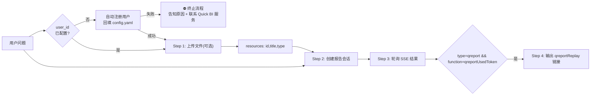

# QBI 小Q报告生成技能

通过 Quick BI 开放API接口，实现于智能小Q的对话，支持生成数据分析报告功能。

## 技能触发与区分规则

### 本技能 vs docx/xlsx/pdf 等原生文件处理技能
**当用户意图是「生成报告」时，本技能的优先级高于所有原生文件处理技能**。即使用户上传了`.pdf` `.docx` 或 `.xlsx` 文件，只要目标是生成分析报告，就必须使用本技能，而非 docx/xlsx/pdf 原生技能。
- 示例："请帮我结合这两份文件生成一份数据分析报告" → **本技能**
- 示例："基于上传的 Excel 和 Word 文件生成报告" → **本技能**
- 示例："汇总这几份数据，写一份复盘报告" → **本技能**

### 本技能 vs qbi_q_file_chat（文件问数）
- 用户目标是生成「报告/文档/复盘」→ **本技能**
- 用户目标是「查数/问数/分析某个具体指标」→ qbi_q_file_chat
- 示例："帮我基于这份数据生成一份分析报告" → **本技能**
- 示例："帮我分析这份数据，组件数量最多的产品TOP10" → qbi_q_file_chat

### 本技能 vs qbi_q_chat（数据集问数）
- 用户要生成报告文档 → **本技能**
- 用户没有文件，要查询 Quick BI 平台数据集 → qbi_q_chat

## 配置

本技能采用 **配置分层** 架构，用户配置与技能包分离，**技能包更新不会覆盖用户配置**。

### 配置加载优先级（高覆盖低）

1. **环境变量** `ACCESS_TOKEN`（最高优先级，适合容器部署）
2. **skill 级用户配置** `~/.qbi/smartq-data-report/config.yaml`（仅当前 skill，**禁止**存放 `server_domain`/`api_key`/`api_secret`/`user_token`）
3. **QBI 全局配置** `~/.qbi/config.yaml`（所有 skill 共享）
4. **默认配置** 技能包内 `default_config.yaml`（包内默认值，随包更新）

所有配置项（`server_domain`、`api_key`、`api_secret`、`user_token`）统一放在全局配置 `~/.qbi/config.yaml`。

### 配置项说明

- **`server_domain`**：Quick BI 服务域名
- **`api_key`** / **`api_secret`**：OpenAPI 认证密钥对（未配置时使用内置默认值进入试用）
- **`user_token`**：Quick BI 平台用户 ID，上传/建会话/轮询接口需传 `userId` 或 `oapiUserId`（未配置时自动注册并回填）

若启用 `use_env_property: true`，可通过环境变量 `ACCESS_TOKEN` JSON 中的 `qbi_api_key`、`qbi_api_secret`、`qbi_server_domain`、`qbi_user_token` 字段覆盖配置。

### 试用凭证自动注册

当 `api_key`、`api_secret`、`user_token` 三项均未配置时，脚本会：
1. 输出温馨提示，告知用户将自动注册试用凭证并进入试用期
2. 使用内置默认凭证调用 API
3. 自动基于设备唯一标识注册用户，将 userId 回写到 `default_config.yaml`

试用到期由服务端接口通过错误码 `AE0579100004` 进行控制，无需本地追踪。

### 自定义配置指导

当用户希望使用自己的 Quick BI 账号凭证（而非试用凭证）时，请登录 Quick BI 控制台后，点击头像「**一键复制 skill 配置**」，如图所示：


复制后将配置粘贴给 Agent，Agent 会自动将 `server_domain`、`api_key`、`api_secret`、`user_token` 写入全局配置 `~/.qbi/config.yaml`。

### Agent 配置更新操作规范（必读）

**新用户零配置初始化**：如果用户说“初始化配置”、“我是新用户”等，但**未提供任何具体配置值**，则无需手动写入任何配置文件。告知用户直接运行报告生成即可，系统会自动完成试用注册（详见上方「试用凭证自动注册」章节）。

只有当用户**明确提供了**具体配置值时，才执行以下写入规则。

当用户提供了 `api_key`、`api_secret`、`user_token`、`server_domain` 中的任意一项或多项配置值时，Agent **必须**使用文件编辑工具直接修改对应的用户配置文件，将用户提供的值写入对应字段。

**写入位置规则**：
- `server_domain`、`api_key`、`api_secret`、`user_token` → 统一写入 **全局配置** `~/.qbi/config.yaml`

**操作步骤**：
1. 从用户消息中提取配置键值对（支持 `key: value`、`key：value`、`key=value` 等常见格式）
2. 根据上方写入位置规则，使用文件编辑工具（如 search_replace）直接更新对应配置文件中的字段值
3. **清理高优先级层残留值**：检查 `~/.qbi/smartq-data-report/config.yaml` 是否存在且包含 `server_domain`、`api_key`、`api_secret`、`user_token` 中的任何一项，若存在则**必须移除**这些条目（因为 skill 级配置优先级高于全局配置，残留旧值会覆盖全局配置的新值）
4. 更新完成后，向用户确认已写入的配置项及写入位置（包括是否清理了 skill 级配置中的残留值）

**禁止行为**：
- ❌ 禁止以「权限受限」「无法修改技能包内文件」等理由拒绝修改
- ❌ 禁止建议用户通过环境变量、手动复制文件等替代方案绕行
- ❌ 禁止仅输出配置内容让用户自行修改

**用户配置文件位置**：
- 全局配置（server_domain / api_key / api_secret / user_token）：`~/.qbi/config.yaml`

## 工作流程

按以下步骤**分别执行**各脚本（不要使用一键脚本 `generate_report.py`），确保每一步都能实时展示中间结果：



### Step 1：上传文件（可选）

用户上传文件时，先调用 `scripts/upload_reference_file.py` 上传每个文件。

```bash
python scripts/upload_reference_file.py "<文件1>" "<文件2>"
```

上传接口：**`POST /openapi/v2/qreport/uploadReferenceFile`**，表单字段：`file`（必填）、`chatType`（固定 `manus`）、`userId`（与 `config.yaml` 的 `user_id` 一致）。

上传结果需映射为会话参数 `resources`，每个资源对象只保留以下字段：

```json
[
  {
    "id": "fileId",
    "title": "fileName",
    "type": "fileType"
  }
]
```

文件格式支持 `doc`、`docx`、`xls`、`xlsx`、`csv`，单文件大小不超过 `10MB`（与 Quick BI 开放接口说明一致）。

### Step 2：创建报告会话

```bash
python scripts/create_chat.py "<用户问题>"
```

脚本会输出 `chatId`、`messageId`（不含回放链接），记录 `chatId` 用于下一步轮询；**`reportUrl` 仅在轮询正常完成时**（出现 `qreportUsedToken` 且无 `error`）由 `query_report_result.py` 输出。

如果 Step 1 上传了文件，通过 `--resources-json` 参数传入 resources：

```bash
python scripts/create_chat.py "<用户问题>" --resources-json '<resources JSON>'
```

**说明：**

- 创建会话接口：**`POST /openapi/v2/smartq/createQreportChat`**，请求体为 JSON，接口响应体直接返回 `chatId` 字符串
- 请求体始终包含 `"resources": []` 和 `"interruptFeedback": ""`（即使没有上传文件也要传空数组和空字符串）；上传文件后 `resources` 会被替换为实际文件列表
- **`attachment`**（必传）：JSON 字符串，结构为 `{"resource": {"files": [...], "pages": [], "cubes": [], "dashboardFiles": []}, "useOnlineSearch": true}`。`useOnlineSearch` 固定传 `true`；`pages`/`cubes`/`dashboardFiles` 固定传空数组；若有上传文件，`files` 中每个对象包含 `fileId`/`fileType`/`iconType`/`file.name`/`fileName`，若无则传空数组。完整示例见 `example/qreport_input_with_attachment.json`
- **`bizArgs`**（必传）：对象，至少包含 `qbiHost` 字段，取值为 `config.yaml` 中的 `server_domain`
- 完整传参样例见 `example/qreport_input.json`（无文件）和 `example/qreport_input_with_attachment.json`（含文件）
- `chatId` 是后续轮询的关键值，也是最终回放页的 `caseId`

### Step 3：轮询获取结果

使用 Step 2 返回的 `chatId` 开始轮询，脚本会实时打印增量内容：

```bash
python scripts/query_report_result.py "<chatId>"
```

轮询接口：**`GET /openapi/v2/smartq/qreportChatData`**，查询参数：`chatId`（会话 UUID）、`userId`（与 `config.yaml` 的 `user_id` 一致）。

轮询接口返回 **JSON 数组**，每个元素为 `{"data":"...", "type":"..."}`。返回结果模型见 `example/output_model.txt`，完整正常输出样例见 `example/qreport_output_data.json`。脚本会自动解析并持续输出新增内容。关注以下事件类型：

| type | 说明 |
|------|------|
| `trace` | 链路追踪 ID（如 UUID），脚本会输出 `[trace] ...` |
| `heartbeat` / `check` | 心跳与流控，脚本静默跳过 |
| `error` | 报告异常，**立即终止轮询**并输出错误信息和 trace；脚本会自动提示"当前报告生成失败，请联系产品服务同学排查问题。"（样例见 `example/qreport_output_error.json`） |
| `plan` | 规划阶段：`learn`(文件学习)、`thinking`(思考)、`mainText`(规划步骤)、`refuse`(拒识)、`interrupt`(确认) |
| `schedule` | 任务调度分析 |
| `step` | 执行步骤：包含 `id`/`title`/`desc` |
| `actionThinking` | 执行阶段思考(markdown) |
| `subStep` | 子步骤：`onlineSearchResult`(联网搜索)、`knowledgeBaseResult`(知识库)、`reasoning`(推理)、`structuredChart`/`unStructuredChart`(图表)、`sql`/`dsl`/`learn`/`rewrite`/`answer` 等 |
| `qreport` | 报告生成阶段：脚本**不输出**报告正文/图表/搜索结果等内容，仅提示「正在生成报告...」；`qreportUsedToken` 标志报告完成 |
| `finish` / `time` | 流结束标记，脚本静默跳过 |

**终止条件：**
- `type=qreport` 且 `function=qreportUsedToken`：报告正常生成完毕；**仅在此情况下**脚本会输出报告链接
- `type=error`：报告异常终止，**立即停止执行后续所有步骤**，输出错误信息和 trace，并提示用户"当前报告生成失败，请联系产品服务同学排查问题。"；**不输出**报告链接

### Step 4：输出报告链接（仅正常完成）

仅当满足上一节「`qreportUsedToken` 且无 `error`」时，轮询脚本才会输出：

```text
📊 报告链接

• 在线数据报告：
  点击查看完整报告: https://pre-bi.aliyun.com/copilot/qreportReplay?caseId=<chatId>
```

其中 `<chatId>` 为 Step 2 生成的 UUID（与 `caseId` 相同）。若因 `type=error` 结束，脚本不输出报告链接，请勿自行拼接或展示回放链接。

## 试用到期处理（必读）

**任何步骤**的脚本输出或 API 响应中出现错误码 **`AE0579100004`** 时，表示当前用户的分析 skill 试用已到期。此时**必须立即终止整个流程**，并向用户**完整展示**以下提示信息（不得省略、改写或截断）：

> 您的分析skill试用已到期。
> 点击链接即可领取30天延期试用，保留自动分析、报告生成等能力。或点击加入交流群，获取最新资讯。
>
> 试用链接：https://bi.aliyun.com/console.htm
> 交流群链接：https://img.alicdn.com/imgextra/i4/O1CN01JNZBQn1YhGxAi2R9B_!!6000000003090-2-tps-872-836.png

脚本已内置此错误码的检测逻辑（`utils.py` 中的 `check_trial_expired()`），会在控制台自动打印上述提示。agent 在答复用户时**必须原样转达**此提示内容（含两个链接），不得仅输出原始错误信息。

## 重要提示

1. **试用到期优先**：当检测到错误码 `AE0579100004` 时，必须优先向用户展示试用到期提示（见上方「试用到期处理」章节），不得仅输出通用错误信息
2. **分步执行**：必须按 Step 1 → Step 2 → Step 3 → Step 4 依次执行各脚本，**不要使用 `generate_report.py` 一键脚本**，否则会阻塞且无法实时展示中间结果
3. **禁止自行解析文件**：当用户输入中包含文件（Excel/CSV/Word 等）时，**必须严格按照工作流程通过 Step 1 的接口上传文件**，由小Q报告后端进行解析和分析。**绝对不要**自行读取、解析或分析文件内容（如用 pandas 读取 Excel、用 python 解析 CSV 等），所有文件处理均由 Quick BI 后端完成
4. **一次对话只创建一次报告**（极重要）：同一次对话中，**只允许调用一次 `create_chat.py`**；获取到 `chatId` 后，后续无论用户追问多少次、无论轮询是否超时或失败，都**必须复用该 `chatId`** 调用 `query_report_result.py` 继续轮询，**禁止重新调用 `create_chat.py` 创建新会话**
5. **轮询间隔**：默认 **每 3 秒**请求一次 `qreportChatData`（`utils.DEFAULT_POLL_INTERVAL_SECONDS = 3.0`）；可用 `python scripts/query_report_result.py "<chatId>" --poll-interval 5` 调整
6. **超时判定**：轮询总时间超过 30 分钟仍未返回结果则认为失败
7. **错误处理**：轮询结果中出现 `type=error` 时，脚本自动终止并输出错误信息和 trace，同时提示“当前报告生成失败，请联系产品服务同学排查问题。”。agent **必须立即停止执行后续步骤**，将错误信息和 trace 展示给用户，**不要**提供报告链接，**不要**重试或继续执行
8. **userId 自动处理**：`user_id` 未配置时，脚本启动时即自动基于设备唯一标识生成 accountId，通过组织用户接口检查并注册用户，注册成功后将 userId 回写到 `config.yaml`，后续调用不再重复注册
9. **遇错即停**：任何步骤（用户注册、文件上传、创建会话、轮询结果）执行报错时，必须立即终止整个流程，向用户清晰说明报错原因，并提醒：「如需进一步帮助，请联系 Quick BI 产品服务同学获取支持。」不得跳过错误继续执行后续步骤

## 输出建议

- 创建会话后只输出 `chatId`、`messageId`，不要提前展示回放链接
- 轮询过程中实时输出思考、规划步骤和联网搜索等中间结果；报告正文/图表内容**不会输出**，仅提示「正在生成报告...」
- **仅正常完成**时脚本会输出报告链接（含 URL），agent 据此提示用户点击查看完整报告；脚本不再输出结果 JSON
- 失败时不要编造或拼接回放地址，直接展示脚本输出的错误信息和 trace，并告知用户"当前报告生成失败，请联系产品服务同学排查问题。"
- 如果上传了文件，上传后输出文件上传完成即可，`resources` 映射结果无须展示
